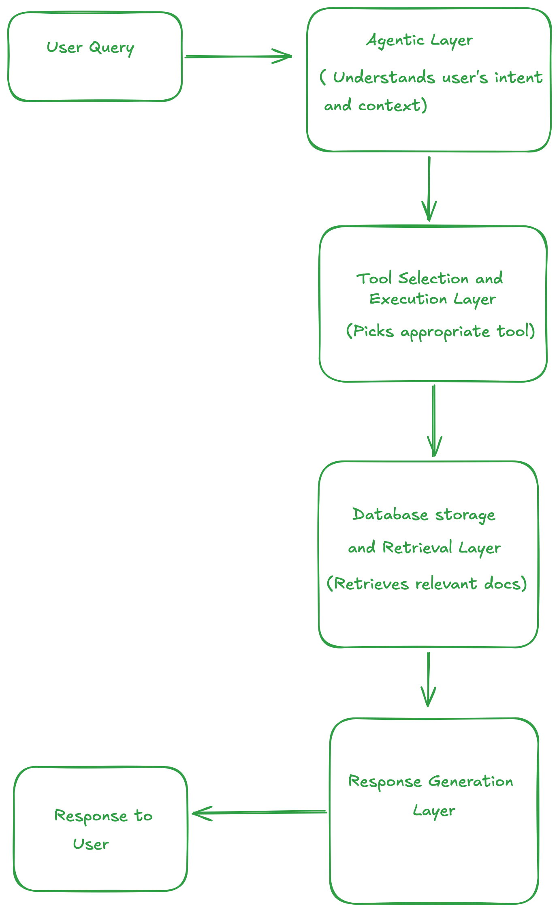

## EU Navigator

An AI Agent tool that helps students and migrants understand public services (health, tax ids and residence permits) that are written in different languages than their own language. Currently, it supports English, Hindi, German, French and Spanish

### Architecture

